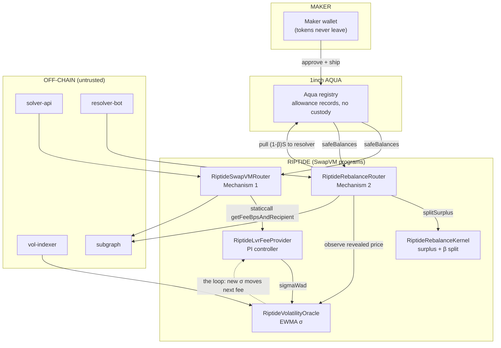

# RIPTIDE

**An automated market maker on [1inch Aqua](https://github.com/1inch/aqua) and [SwapVM](https://github.com/1inch/swap-vm) that charges for, and takes back, the money that liquidity providers normally lose to arbitrage.**

**[▶ Open the live app](https://riptide-web-production-77f7.up.railway.app)** · [Contracts and addresses](#deployed-addresses) · [How it actually works](#part-ii--how-it-works-under-the-hood)

---

## Important links

| | |
|---|---|
| **Live app** | https://riptide-web-production-77f7.up.railway.app |
| **Demo video** | _coming soon_ |
| **Network** | Base Sepolia (chain `84532`) — [explorer](https://sepolia.basescan.org) |
| **Subgraph** | [Graph Studio endpoint](https://api.studio.thegraph.com/query/1758400/riptide/version/latest) |
| **Deployment manifest** | [`deployments/84532.json`](deployments/84532.json) — the single source of truth for every address |

**Contracts on BaseScan**

| Contract | What it is |
|---|---|
| [`RiptideSwapVMRouter`](https://sepolia.basescan.org/address/0x6Ad25D6111E1DfFD6d809cab5e4D012A95a341cD) | Mechanism 1 — the Aqua app + SwapVM router for taker swaps |
| [`RiptideRebalanceRouter`](https://sepolia.basescan.org/address/0xF2f6AFf9d4BA247F479c67d1a9EB19A4a9C788bf) | Mechanism 2 — hosts the custom rebalance instruction (opcode 34) |
| [`RiptideLvrFeeProvider`](https://sepolia.basescan.org/address/0x27fadE9f02fCC91152fdac73b55E1E05C2BB8620) | The `IProtocolFeeProvider` 1inch SwapVM staticcalls for the live fee |
| [`RiptideVolatilityOracle`](https://sepolia.basescan.org/address/0x9E311E6C2694e475e9F44bB6Bc052823c6b647B3) | On-chain EWMA volatility estimator (σ) |
| [`RiptideBatchExecutor`](https://sepolia.basescan.org/address/0xd86172dCEBC594005576a368D64a6c5901B3103e) | Atomic multi-maker taker settlement |
| [`RiptideAuctionSettler`](https://sepolia.basescan.org/address/0xf0c77bC88109e2c4c5A44B470f0da8221fBbee2D) | Permissionless rebalance settlement entrypoint |
| [`Aqua`](https://sepolia.basescan.org/address/0xa6e7714D9956D88C4f26C19a481b12bB60B90Ed2) | 1inch Aqua v1.0.0 (unmodified) — holds every maker allowance |

[Full address table, including kernel, quoter, lens, demo tokens and the mock feed →](#deployed-addresses)

**Specifications** — read in this order

| Doc | Owns |
|---|---|
| [`docs/INDEX.md`](docs/INDEX.md) | Map of the whole spec set |
| [`docs/SOURCES.md`](docs/SOURCES.md) | The honesty ledger: what was verified, what was kept, what was scrapped and why |
| [`docs/PROTOCOL.md`](docs/PROTOCOL.md) | The product and protocol end to end |
| [`docs/LVR_MATH.md`](docs/LVR_MATH.md) | Every normative equation, unit and rounding rule |
| [`docs/SWAPVM_INTEGRATION.md`](docs/SWAPVM_INTEGRATION.md) | How the maths becomes SwapVM bytecode over Aqua |
| [`docs/CONTRACTS.md`](docs/CONTRACTS.md) | Every contract, event, error and invariant |
| [`docs/SYSTEM.md`](docs/SYSTEM.md) | Component inventory, flows, deployment |
| [`docs/UI.md`](docs/UI.md) | Every page and the per-persona user stories |
| [`docs/DIFF_ORACLE.md`](docs/DIFF_ORACLE.md) | The Python differential oracle and the committed vectors |
| [`docs/FEATURES.md`](docs/FEATURES.md) | Traceability matrix — no feature without a reference |
| [`docs/WALKTHROUGH.md`](docs/WALKTHROUGH.md) | The demo script |

**Build & operations notes**

| Doc | Owns |
|---|---|
| [`RESOLUTIONS.md`](RESOLUTIONS.md) | What was actually decided at build time — **authoritative where it disagrees with `docs/`** |
| [`DEPENDENCY_LOCK.md`](DEPENDENCY_LOCK.md) | Pinned 1inch/OZ/Solady commits, licences, toolchain versions |
| [`ENV.md`](ENV.md) | Environment variables and operator overrides |
| [`LN_EXP_BOUNDS.md`](LN_EXP_BOUNDS.md) | Solady ln/exp/pow domains used on-chain |
| [`deployments/README.md`](deployments/README.md) | Manifest schema and redeploy recipes |

**Research** — [arXiv:2208.06046](https://arxiv.org/abs/2208.06046) ([PDF](docs/LVR_PAPER.pdf)) · [arXiv:2210.10601](https://arxiv.org/abs/2210.10601) ([PDF](docs/DIAMOND_LVR.pdf)) · [arXiv:2305.14604](https://arxiv.org/abs/2305.14604) ([PDF](docs/FEESvLVR.pdf))

**Upstream** — [1inch Aqua](https://github.com/1inch/aqua) · [1inch SwapVM](https://github.com/1inch/swap-vm) · [ETHOnline 1inch track](https://ethglobal.com/events/ethonline2026/prizes)

---

## Introduction

If you put money into a normal AMM pool — Uniswap, a Curve pool, anything with a fixed curve — you are running a market-making business whether you meant to or not. You quote a price. Someone trades against it. You collect a fee.

The problem is that your price is always slightly out of date. The moment the real price of ETH moves on Binance, your pool is still quoting the old price. Someone notices in a few hundred milliseconds and trades against your stale quote. They make money. That money comes out of your pocket.

This is not a bug and it is not front-running. It is the normal, permanent cost of quoting a price you cannot update fast enough. It has a name — **Loss-Versus-Rebalancing**, or LVR — and since 2022 there has been a precise formula for how much it costs you.

RIPTIDE is one pool design that does two things about it: it **prices** that cost into the fee, and it **sells the right to correct the stale price** instead of letting it be taken for free.

---

## The problem, concretely

Say you provide liquidity to an ETH/USDC pool. Over a year:

- You earn trading fees from ordinary traders — people swapping because they want to swap.
- You lose money to arbitrageurs — people swapping *only* because your price is stale.

Whether you come out ahead is simply whether the first number beats the second. The 2022 LVR paper made this exact rather than vibes-based. For a constant-product pool, the rate you leak to arbitrage is:

```
LVR rate  =  σ² / 8   of the pool's value, per unit time
```

where `σ` is the volatility of the asset. At 100% annualised volatility, that is **one eighth of the pool's value per year**, flowing to arbitrageurs, before you collect a single fee.

Two things follow, and almost every AMM ignores both:

1. **A fixed fee is the wrong instrument.** Your cost is proportional to `σ²`, which moves constantly. A flat 30 bps fee overcharges traders on quiet days and badly undercharges on volatile ones — exactly when you need the money.

2. **The arbitrage profit is not a law of nature — it is an auction you are not running.** When your pool is stale, there is a known, quantifiable amount of money sitting on the table. Today it goes to whoever pays the highest priority fee. It could instead go to whoever pays *you* the most for the right to take it.

## The research we built on

Three papers, all included in this repository as PDFs and audited in [`docs/SOURCES.md`](docs/SOURCES.md). Nothing in RIPTIDE's economics is invented; these supply the numbers.

| Paper | What we take from it |
|---|---|
| **Automated Market Making and Loss-Versus-Rebalancing** — Milionis, Moallemi, Roughgarden, Zhang. [arXiv:2208.06046](https://arxiv.org/abs/2208.06046) · [local PDF](docs/LVR_PAPER.pdf) | The definition and closed form of the cost. `ℓ(σ,P) = (σ²P²/2)·\|x*′(P)\|`, and for a constant-product pool `ℓ/V = σ²/8`. Also the identity that decides everything: **LP value − rebalancing value = fees − accumulated LVR.** |
| **An Automated Market Maker Minimizing Loss-Versus-Rebalancing** ("Diamond") — McMenamin, Daza, Mazorra. [arXiv:2210.10601](https://arxiv.org/abs/2210.10601) · [local PDF](docs/DIAMOND_LVR.pdf) | The recapture result. If you auction the rebalancing right and keep a fraction `β`, the LVR that escapes to arbitrageurs is bounded: `E[LVR to arbitrageurs] ≤ (1−β)·L`. Their simulations use `β = 0.95`. |
| **Automated Market Making and Arbitrage Profits in the Presence of Fees** — Milionis, Moallemi, Roughgarden. [arXiv:2305.14604](https://arxiv.org/abs/2305.14604) · [local PDF](docs/FEESvLVR.pdf) | The principle that the fee is the instrument that offsets LVR, and that there is an interior optimum — too low and you bleed to arbitrage, too high and the flow leaves. We take the *principle*, not a closed-form constant. |

Two standard engineering techniques come from outside that set and are labelled as such throughout: EWMA/RiskMetrics volatility estimation and Garman–Klass range estimation, and a clamped PI feedback controller. These are estimation and control mechanics, not economic claims. See [`docs/SOURCES.md` §5](docs/SOURCES.md).

Papers we deliberately did **not** use — FM-AMM, general convex CFMM routing, payoff replication, LP hedging, options-on-LP — are listed with a written reason for each in [`docs/SOURCES.md` §4](docs/SOURCES.md). The filter was usefulness to this product, not difficulty.

---

## What we built

A RIPTIDE strategy is an ordinary constant-product pool — `x · y = k`, nothing exotic — with two control layers wrapped around it.

### Mechanism 1 — a fee that tracks volatility

The fee is not a number the maker guesses. An on-chain controller reads a live volatility estimate and steers the fee toward the break-even point where expected fee revenue covers expected LVR:

```
break-even fee  φ*  =  (σ̂² / 8) / λ        →  clamped into [feeMin, feeMax]
                                            →  PI controller steps toward it
```

Volatile market, higher fee. Calm market, lower fee. From a trader's point of view it is just a protocol fee that happens to be current, delivered through 1inch's existing fee instruction — **we added no new fee opcode**.

Math: [`docs/LVR_MATH.md` §4](docs/LVR_MATH.md) · Code: [`FeeController.sol`](contracts/src/libraries/FeeController.sol) and [`RiptideLvrFeeProvider.sol`](contracts/src/fees/RiptideLvrFeeProvider.sol)

### Mechanism 2 — auction the stale price instead of donating it

When the external price gaps, the pool is mispriced and there is arbitrage value available. Instead of letting the mempool take it:

- The strategy opens a **declining-price Dutch auction** for the right to rebalance the pool.
- Resolvers compete; competition drives the fill to where the resolver's margin is thin.
- On settlement the contract measures the actual surplus `S`, pays the resolver `⌊(1−β)·S⌋` and **leaves at least `β·S` with the liquidity provider**.
- A reverse swap immediately afterward is penalised, so nobody can sandwich the rebalance.

With `β = 0.95`, at most about 5% of the arbitrage value leaves; the rest stays with the LP.

Math: [`docs/LVR_MATH.md` §5](docs/LVR_MATH.md) · Code: [`RiptideRebalanceModule.sol`](contracts/src/core/RiptideRebalanceModule.sol), [`DiamondSplit.sol`](contracts/src/libraries/DiamondSplit.sol)

### The loop between them

A resolver only bids when rebalancing is genuinely profitable, so the price it pays is a price somebody *actually put money behind*. That price is fed back into the volatility oracle, which moves the next fee target. The fee is partly calibrated by prices that were paid for rather than merely reported.

This is a design property, not a theorem, and is labelled that way everywhere it appears — [`docs/LVR_MATH.md` §6](docs/LVR_MATH.md).

---

## Who this is for, and what they actually get

**Liquidity providers / market makers — the people this is built for.**
You keep your tokens in your own wallet. Aqua holds an allowance record, not your money, so there is no vault to trust and no LP share token. You set a fee band and a retention parameter `β`, and then two things happen automatically that don't happen in a normal pool: your fee rises when volatility rises (so you're charging more precisely when you're losing more), and when the price gaps, the profit from re-pricing your pool is auctioned and most of it comes back to you instead of going to a searcher. The [Strategy Manager](apps/web/src/app/positions/page.tsx) shows you the number that matters: cumulative value recaptured.

**Traders.** You get a quote where the fee and the volatility that produced it are both shown before you sign. The fee is not retroactive and not hidden. Your order is split across makers by a solver and settles atomically — if any part fails, the whole thing reverts and you keep your funds.

**Resolvers / searchers.** A new, legible source of flow. Instead of racing in the mempool for uncertain profit, you can see open auctions with their current price, preview your exact take `⌊(1−β)·S⌋` before committing, and settle through a permissionless entry point. If the trade has no genuine surplus, the contract refuses it — which protects you from a bad fill as much as it protects the maker.

**Analysts and researchers.** Every claim in this repository is traceable. The recapture dashboard links each headline number to the on-chain event that produced it and states the indexed block, and an honesty panel marks which claims are verified on-chain versus validated by simulation.

**Who this is not for:** anyone wanting a managed or hedged vault, exotic payoffs, or a new market design. RIPTIDE keeps the plain constant-product curve on purpose. Non-goals are enumerated in [`docs/PROTOCOL.md` §18](docs/PROTOCOL.md).

---

## Fit with the ETHOnline 1inch track

The 1inch track at ETHOnline is *["Build an Aqua App"](https://ethglobal.com/events/ethonline2026/prizes)*:

> "Create a custom Aqua app that implements a sophisticated DeFi position. If you use SwapVM, you may modify SwapVM opcodes and define your own instructions."

with three qualification requirements and one scoring note. How RIPTIDE lines up:

| Track requirement | Status |
|---|---|
| Official Aqua/SwapVM contracts must be used | **Yes.** Pinned as git submodules at `1inch/swap-vm@v1.0.2` (`32c687c2`) and `1inch/aqua@v1.0.0` (`81c26e46`) — see [`DEPENDENCY_LOCK.md`](DEPENDENCY_LOCK.md). The routers inherit `SwapVM` directly. A mainnet fork test ships real WETH/USDC into the **canonical 1inch Aqua registry** at `0x1111113CCf1426A8E30e2bfF5E005d929bF6a90a` and reads them back — [`Provenance.t.sol`](contracts/test/fork/Provenance.t.sol). |
| Onchain token transfers demonstrated (local forks acceptable) | **Yes.** Live on Base Sepolia with three seeded strategies, real ERC-20 movement through Aqua `pull`/`push`. Also reproducible on a local Anvil with `pnpm demo:reset`. |
| Proper Git commit history | **Partially.** 9 commits across 2026-08-28 → 09-07. Not a single-commit entry, but one commit (`74cdea3`) introduces 377 files at once. See [the note below](#known-limitations-and-honest-edges). |
| *Scoring: projects using SwapVM score higher* | **RIPTIDE is SwapVM end to end.** Both mechanisms are SwapVM programs, and it defines a **custom instruction** at opcode index 34 — exactly the "define your own instructions" the track invites. |

The design choice worth calling out: the track permits modifying SwapVM. RIPTIDE deliberately doesn't fork it. The dynamic fee runs through 1inch's existing `_aquaDynamicProtocolFeeAmountInXD` instruction via the standard `IProtocolFeeProvider` hook, and the Dutch auction and anti-sandwich decay are upstream instructions. Only one genuinely new instruction is added, through the documented `_instructions()` override. All five Aqua primitives — `ship`, `dock`, `pull`, `push`, `safeBalances` — are load-bearing.

---

## Deployed addresses

**Base Sepolia (chain 84532)** — manifest: [`deployments/84532.json`](deployments/84532.json) · explorer: [sepolia.basescan.org](https://sepolia.basescan.org)

| Contract | Address |
|---|---|
| Aqua | [`0xa6e7714D9956D88C4f26C19a481b12bB60B90Ed2`](https://sepolia.basescan.org/address/0xa6e7714D9956D88C4f26C19a481b12bB60B90Ed2) |
| RiptideSwapVMRouter | [`0x6Ad25D6111E1DfFD6d809cab5e4D012A95a341cD`](https://sepolia.basescan.org/address/0x6Ad25D6111E1DfFD6d809cab5e4D012A95a341cD) |
| RiptideRebalanceRouter | [`0xF2f6AFf9d4BA247F479c67d1a9EB19A4a9C788bf`](https://sepolia.basescan.org/address/0xF2f6AFf9d4BA247F479c67d1a9EB19A4a9C788bf) |
| RiptideRebalanceKernel | `0x24670F2a8d04665e1784Dbc3Eb8e58Fb6eACD9f2` |
| RiptideVolatilityOracle | `0x9E311E6C2694e475e9F44bB6Bc052823c6b647B3` |
| RiptideLvrFeeProvider | `0x27fadE9f02fCC91152fdac73b55E1E05C2BB8620` |
| RiptideAuctionSettler | `0xf0c77bC88109e2c4c5A44B470f0da8221fBbee2D` |
| RiptideQuoter | `0x165Db89FbfAF978FbdBe322b0a1b34a9Bfef04b5` |
| RiptideLens | `0x70237cf49964E1e42Ac2502D3D87d565E040891c` |
| RiptideBatchExecutor | [`0xd86172dCEBC594005576a368D64a6c5901B3103e`](https://sepolia.basescan.org/address/0xd86172dCEBC594005576a368D64a6c5901B3103e) |
| Demo tokens | RBASE [`0xCd75c96a6659d94004EFBe528D95eAF933A916be`](https://sepolia.basescan.org/address/0xCd75c96a6659d94004EFBe528D95eAF933A916be) · RQUOTE [`0x5A2858D733295000199CA9030e4A094e9E9EF846`](https://sepolia.basescan.org/address/0x5A2858D733295000199CA9030e4A094e9E9EF846) |
| Mock Chainlink feed | `0x92a149C90d5C43DF299F9db5F8F3c3cC7C7Edd0D` |

Deployed at block `46653287`. Subgraph: [`riptide` on Graph Studio](https://api.studio.thegraph.com/query/1758400/riptide/version/latest).

Three strategies are seeded and live, each with a different fee/auction policy:

| | Maker | `feeMin` | `feeMax` | `beta` | Auction |
|---|---|---|---|---|---|
| S1 | `0xddDe7a54E430B1D85d24956156867fCe2407dC25` | 10_000 (0.1%) | 50_000 | 0.97 | 7200s, decay 0.995 |
| S2 | `0xad5f8F512C9CD73c74B274D9e84e431ac631ED3C` | 30_000 (0.3%) | 500_000 | 0.95 | 3600s, decay 0.99 |
| S3 | `0x9f7f68976C876DA2656FB835b051DE31Fc5863E6` | 50_000 (0.5%) | 800_000 | 0.90 | 1800s, decay 0.98 |

**Note on Aqua provenance.** 1inch has no Base Sepolia deployment, so the demo deploys its **own instance of the unmodified official `@1inch/aqua` v1.0.0 `Aqua.sol`** ([`RiptideDeployer.sol:38`](contracts/script/RiptideDeployer.sol#L38)). Integration against the *real* 1inch mainnet deployment is proven separately by the mainnet fork test above. Anvil manifest: [`deployments/31337.json`](deployments/31337.json).

---

## Repository map

```
contracts/          Foundry project — 35 source files, 44 test files, 113 tests
  src/types/          RiptideTypes, RiptideErrors            shared structs + 30 named errors
  src/libraries/      WadMulDiv, LnExpMath, CpmmMath,        the math layer
                      VolatilityMath, LvrMath, FeeController,
                      DiamondSplit, DutchPow
  src/oracle/         RiptideVolatilityOracle                EWMA/GK realized-vol estimator
  src/fees/           RiptideLvrFeeProvider                  Mechanism 1 — IProtocolFeeProvider
  src/core/           RiptideSwapVMRouter                    Mechanism 1 router (Aqua app)
                      RiptideRebalanceRouter + Module        Mechanism 2 router + logic
                      RiptideRebalanceKernel                 stateless surplus/β/auction math
                      RiptideStrategyCodec                   226-byte payload codec
                      RiptideSwapOpcodes / RiptideOpcodes    instruction tables
                      RiptideDutchHandlers                   Dutch auction handlers
                      RiptideMakerTraits                     MakerTraits packing
  src/periphery/      Quoter, Lens, AuctionSettler, BatchExecutor
  script/             deploy, seed, ship, dock, rebalance, batchExecute, demo
  lib/                pinned 1inch submodules (swap-vm v1.0.2, aqua v1.0.0)

packages/
  riptide-math/       exact TypeScript mirror of the on-chain math
  strategy-sdk/       payload encode/decode, policyHash / strategyKey / marketId
  contracts/          generated ABIs, deployment manifest loader, network config
  solver-core/        pure taker route optimiser + subgraph/RPC discovery
  resolver-core/      pure rebalance evaluator (surplus, β-split, timing)
  frontend-api/       framework-neutral UI gateway + deterministic mock

services/
  solver-api/         HTTP :8081 — discover, quote, optimise, simulate, return calldata
  resolver-bot/       :8082 — watches auctions, settles profitable rebalances
  vol-indexer/        :8083 — publishes price observations to the oracle
  liquidity-mcp/      :8084 — MCP server exposing executable-liquidity tools

subgraph/             The Graph — 10 entities, 5 datasources, matchstick tests
apps/web/             Next.js 15 — 6 pages, one per persona
tools/reference/      Python differential oracle (stdlib Decimal, no deps)
test/vectors/         6 committed JSON vector files — the shared source of truth
docs/                 9 normative specs + 3 research PDFs
```

Specification set, in reading order: [`SOURCES.md`](docs/SOURCES.md) → [`PROTOCOL.md`](docs/PROTOCOL.md) → [`LVR_MATH.md`](docs/LVR_MATH.md) → [`SWAPVM_INTEGRATION.md`](docs/SWAPVM_INTEGRATION.md) → [`CONTRACTS.md`](docs/CONTRACTS.md) → [`SYSTEM.md`](docs/SYSTEM.md) → [`UI.md`](docs/UI.md) → [`DIFF_ORACLE.md`](docs/DIFF_ORACLE.md) → [`FEATURES.md`](docs/FEATURES.md). Index: [`docs/INDEX.md`](docs/INDEX.md).

---
---

# Part II — How it works under the hood

Everything below is mechanical. Every claim cites the file and line that implements it.

## 1. Architecture



The trust boundary is the important part. Everything in the off-chain box can propose a bad route, a losing bid, or a stale estimate — and none of it can move maker inventory, settle a loss-making rebalance, or make the settled fee differ from the quoted fee. The contracts recompute everything. See [`docs/PROTOCOL.md` §12](docs/PROTOCOL.md).

## 2. How Aqua is used

Aqua is a shared-liquidity registry: it holds **allowance records**, not tokens. A maker approves Aqua once and distributes virtual balances across strategies; the real tokens stay in the maker's wallet until pulled during a trade. RIPTIDE's routers are registered as Aqua *apps*.

All five primitives are load-bearing ([`IAqua.sol`](contracts/lib/aqua/src/interfaces/IAqua.sol)):

| Primitive | Where RIPTIDE uses it |
|---|---|
| `ship(app, strategy, tokens, amounts) → strategyHash` | Maker publishes a strategy. Called from the maker's own wallet — [`RiptideSeedLib.sol:136`](contracts/script/RiptideSeedLib.sol#L136) and the web ship plan. RIPTIDE contracts never call it. |
| `safeBalances(maker, app, strategyHash, t0, t1)` | Every quote and swap. SwapVM seeds `balanceIn`/`balanceOut` from it before running the program; RIPTIDE re-reads it for telemetry at [`RiptideSwapVMRouter.sol:107`](contracts/src/core/RiptideSwapVMRouter.sol#L107) and in [`RiptideLens.sol`](contracts/src/periphery/RiptideLens.sol). Never cached. |
| `pull(maker, strategyHash, token, amount, to)` | Swap output to the taker; the **β rebate to the resolver** — [`RiptideRebalanceRouter.sol:81`](contracts/src/core/RiptideRebalanceRouter.sol#L81); and the protocol fee, pulled by SwapVM itself. |
| `push(maker, app, strategyHash, token, amount)` | Taker input credited to the maker's strategy, via SwapVM's `_transferIn` when the taker traits set `useTransferFromAndAquaPush`. |
| `dock(app, strategyHash, tokens)` | Maker cancels and releases balances — [`dock.s.sol:40`](contracts/script/dock.s.sol#L40). |

**There is no RIPTIDE vault.** No contract in `contracts/src/` ever holds maker inventory.

## 3. SwapVM: how a RIPTIDE strategy becomes bytecode

### 3.1 The three byte layers

SwapVM executes a **program** — a sequence of instructions, each encoded as:

```
[opcode : 1 byte][argsLength : 1 byte][args : N bytes]
```

RIPTIDE packs three distinct things into one order ([`docs/SWAPVM_INTEGRATION.md` §1](docs/SWAPVM_INTEGRATION.md)):

```
order.data   = [ 226-byte RIPTIDE payload ][ program bytes ]
order.traits = (1 << 254) | (226 << 208)
order.maker  = maker
```

- `1 << 254` is `USE_AQUA_INSTEAD_OF_SIGNATURE_BIT_FLAG` — it tells SwapVM to authorise via Aqua rather than a signature, and to seed reserves from `safeBalances`.
- `226 << 208` writes the program start offset into MakerTraits slice index 3, so `MakerTraitsLib.program(traits, data)` returns `data[226:]`.

Implemented in [`RiptideMakerTraits.sol:14-20`](contracts/src/core/RiptideMakerTraits.sol#L14-L20), frozen by [`MakerTraitsFreeze.t.sol`](contracts/test/unit/MakerTraitsFreeze.t.sol).

Because the Aqua trait is set, `SwapVM.hash(order)` is plain `keccak256(abi.encode(order))` — the same value Aqua computes as `strategyHash`. That identity is what makes `safeBalances(maker, router, orderHash, …)` resolve. It also means **any change to the payload, program, or auction start produces a different Aqua position.**

### 3.2 The 226-byte payload

Fixed-length, packed big-endian, magic `RPT1` (`0x52505431`). Encoded and validated by [`RiptideStrategyCodec.sol`](contracts/src/core/RiptideStrategyCodec.sol), mirrored bit-for-bit in TypeScript ([`strategy-sdk/src/codec.ts`](packages/strategy-sdk/src/codec.ts)) and Python ([`tools/reference/payload_codec.py`](tools/reference/payload_codec.py)).

| Offset | Bytes | Field |
|---:|---:|---|
| 0 | 4 | magic `RPT1` |
| 4 | 1 | version = 1 |
| 5 / 25 | 20 / 20 | `baseToken` / `quoteToken` |
| 45 | 32 | `salt` |
| 77 / 93 | 16 / 16 | `reserveBaseWad` / `reserveQuoteWad` |
| 109 / 112 | 3 / 3 | `feeMin` / `feeMax` |
| 115…162 | 8 × 6 | `lambda`, `kp`, `ki`, `iMax`, `sigmaMin`, `sigmaMax` |
| 163 / 171 / 173 / 181 | 8 / 2 / 8 / 2 | `beta`, `duration`, `decay`, `antiSandwichPeriod` |
| 183 / 203 / 204 | 20 / 1 / 2 | oracle `feed`, `decimals`, `maxStaleness` |
| 206 | 20 | `feeProvider` |
| **226** | | total |

`maker` is deliberately **not** in the payload — identity lives in the order envelope, and `decode` returns `address(0)` for it ([`RiptideStrategyCodec.sol:47`](contracts/src/core/RiptideStrategyCodec.sol#L47)).

`validateStructure` ([`:72-92`](contracts/src/core/RiptideStrategyCodec.sol#L72-L92)) rejects zero/identical tokens, `feeMin == 0`, `feeMin ≥ feeMax`, `feeMax ≥ BPS`, and `lambda`/`beta`/`decay` outside `(0,1)`. **Decoding is never authorisation** — every runtime path re-reads live Aqua balances.

Three identifiers, never interchangeable:

```
policyHash   = keccak256(payload)                            SDK/audit identity
strategyHash = keccak256(abi.encode(order))                  Aqua commitment
strategyKey  = keccak256(abi.encode(maker, salt))            router runtime key
marketId     = keccak256(abi.encode(DOMAIN, base, quote))    direction-sensitive
```

### 3.3 Opcode indices — a subtle detail worth knowing

SwapVM dispatches on an index into a function-pointer array. `AquaOpcodes._opcodes()` builds a fixed 35-element array and converts it to a dynamic one by writing the length into slot 0 with assembly — **overwriting element 0**. So the runtime dispatch index is one *less* than the source position.

RIPTIDE freezes the resulting indices in [`RiptideConstants.sol`](contracts/src/core/RiptideConstants.sol):

| Index | Instruction | Source |
|---:|---|---|
| 13 | `Controls._deadline` | upstream |
| 17 | `XYCSwap._xycSwapXD` (constant product) | upstream |
| 19 | `Decay._decayXD` (anti-sandwich) | upstream |
| 20 | `Controls._salt` | upstream |
| 30 | `Fee._aquaDynamicProtocolFeeAmountInXD` | upstream — **Mechanism 1** |
| **34** | **`_riptideRebalanceOpcode`** | **RIPTIDE — the custom instruction** |
| 35 / 36 | `_dutchAuctionBalanceIn1D` / `Out1D` | copied from upstream |

Rather than trusting the constants, [`OpcodeIndexProbe.t.sol`](contracts/test/unit/OpcodeIndexProbe.t.sol) resolves them from the *real* dispatch table at runtime — the guard against silent upstream renumbering.

The two routers each build their own reduced table ([`RiptideSwapOpcodes.sol:30-41`](contracts/src/core/RiptideSwapOpcodes.sol#L30-L41), [`RiptideOpcodes.sol:16-29`](contracts/src/core/RiptideOpcodes.sol#L16-L29)), omitting unused upstream mixins. This is what keeps them deployable: `RiptideSwapVMRouter` measures **24,548 bytes against the 24,576-byte EIP-170 cap** — 28 bytes of headroom, asserted in CI by [`DeploySeed.t.sol`](contracts/test/script/DeploySeed.t.sol).

### 3.4 The swap program (Mechanism 1) — 41 bytes

Built by [`RiptideSwapVMRouter._buildSwapProgram:125-132`](contracts/src/core/RiptideSwapVMRouter.sol#L125-L132):

| # | Opcode | Byte | args |
|---|---|---|---|
| 1 | `Deadline` | `0x0D` | `uint40 deadline` |
| 2 | `aquaDynamicProtocolFee` | `0x1E` | `address feeProvider` |
| 3 | `XYCSwap` | `0x11` | — |
| 4 | `Salt` | `0x14` | `uint64 salt` |

Execution is **not** linear, because the fee instruction *wraps* the rest. `Fee._feeAmountIn` ([`Fee.sol:277-293`](contracts/lib/swap-vm/src/instructions/Fee.sol#L277-L293)) for exact-in: save `amountIn`, subtract the fee, call `ctx.runLoop()` — which executes the swap and salt with the *net* input — then restore. Afterwards `_tryPullFee` pulls the fee from the maker's Aqua ledger to the receiver. Real trace:

```
Deadline → Fee(pre) → XYCSwap → Salt → Fee(post) → AQUA.pull
```

Note the fee collection is **best-effort by upstream design**: `_tryPullFee` swallows failures and emits `ProtocolFeeSkipped` rather than reverting, so a one-sided maker position stays tradable.

### 3.5 The rebalance program (Mechanism 2) — 86 bytes

Built by [`RiptideRebalanceModule._buildRebalanceProgram:197-218`](contracts/src/core/RiptideRebalanceModule.sol#L197-L218):

| # | Opcode | Byte | args |
|---|---|---|---|
| 1 | `Deadline` | `0x0D` | `uint40 deadline` |
| 2 | `DutchAuctionBalanceIn` | `0x23` | `uint40 start ‖ uint16 duration ‖ uint64 decay` |
| 3 | `Decay` | `0x13` | `uint16 antiSandwichPeriod` |
| 4 | `XYCSwap` | `0x11` | — |
| 5 | **`RiptideRebalance`** | `0x22` | `uint64 beta ‖ uint128 staleInWad ‖ address resolver` |
| 6 | `Salt` | `0x14` | `uint64 salt` |

`Decay` also wraps, so the real trace is:

```
Deadline(13)
  DutchAuctionBalanceIn(35)          balanceIn *= decay^(now − auctionStart)
    Decay(19)  [wrapping]            anti-sandwich virtual reserve offset
      XYCSwap(17)                    amountIn = ⌈out·balanceIn/(balanceOut − out)⌉
      RiptideRebalance(34)           surplus check → β split → Aqua pull
      Salt(20)
    Decay(19)  [post]                record new offsets
```

**`Deadline` is deliberately first.** An expired auction reverts before any balance is touched — asserted as invariant V5 by [`V5DeadlineFirst.t.sol`](contracts/test/invariant/V5DeadlineFirst.t.sol), with a negative control ([`BrokenRebalanceProgram.sol`](contracts/test/negative/BrokenRebalanceProgram.sol)) that moves it last and must fail.

## 4. Mechanism 1 in detail — the volatility-indexed fee

### 4.1 The chain of custody for one fee number

```
price observation → RiptideVolatilityOracle (EWMA) → σ
σ → FeeController.feeTarget → clamp → PI step → feeReported
feeReported → RiptideLvrFeeProvider.getFeeBpsAndRecipient  ← SwapVM staticcalls this
```

### 4.2 Volatility estimation — on-chain

Everything runs in Solidity. [`RiptideVolatilityOracle.sol`](contracts/src/oracle/RiptideVolatilityOracle.sol) per strategy:

```
ratio     = priceWad · WAD / lastPriceWad
logReturn = ln(ratio)                                    LnExpMath.lnWad
dt        = (initialized && ts > lastObsTs) ? ts − lastObsTs : 1
varNext   = λ·prevVar + (1−λ)·(logReturn² [+ gkTerm])    VolatilityMath.ewmaVar
σcand     = sqrt(varNext · WAD / dt)  clamped to [σmin, σmax]
σnext     = isStale ? σprev : σcand                      stale freeze
```

[`VolatilityMath.sol:12-53`](contracts/src/libraries/VolatilityMath.sol#L12-L53). The Garman–Klass term is `0.5·ln(H/L)² − (2ln2 − 1)·ln(C/O)²`, clamped at zero.

**Determinism is the load-bearing property.** `observe` short-circuits when `isStatic` and writes nothing ([`:87-89`](contracts/src/oracle/RiptideVolatilityOracle.sol#L87-L89)) — proved with `vm.record`/`vm.accesses` in [`RiptideVolatilityOracle.t.sol`](contracts/test/unit/RiptideVolatilityOracle.t.sol). Only the rebalance router and the governed `volIndexer` key may observe at all (`onlyObserver`, [`:38-43`](contracts/src/oracle/RiptideVolatilityOracle.sol#L38-L43)).

### 4.3 The fee controller

[`FeeController.sol:23-41`](contracts/src/libraries/FeeController.sol#L23-L41):

```solidity
feeTarget(σ, λ, feeMin, feeMax):
    σ²      = σ·σ/WAD
    φ*      = σ²·WAD / (8·λ)          // break-even: LVR rate ÷ flow intensity
    raw     = φ*·BPS / WAD
    return clamp(raw, feeMin, feeMax)

piStep(state, target):
    e        = target − feeReported
    integral = clamp(integral + ki·e/WAD, ±iMax)          // anti-windup
    return clamp(feeReported + kp·e/WAD + integral, feeMin, feeMax)
```

Worked example, matching [`test/vectors/fee_controller_v1.json`](test/vectors/fee_controller_v1.json):

```
σ = 0.3e18, λ = 0.1e18  →  σ² = 9e16  →  φ* = 1.125e17  →  raw = 1_125_000  →  clamped to feeMax = 500_000
piStep(feeReported = 100_000, I = 0, kp = 0.5e18, ki = 0.1e18, target = 500_000):
   e = 400_000;  I = 40_000;  kp·e = 200_000  →  feeReported = 340_000
```

### 4.4 The provider — and why quote equals swap

[`RiptideLvrFeeProvider.getFeeBpsAndRecipient:79-99`](contracts/src/fees/RiptideLvrFeeProvider.sol#L79-L99) is `view` and writes **nothing**. It returns the *committed* `feeReported` and hard-guards the band, reverting `RiptideFeeOutOfRange` if the value ever escapes `[feeMin, feeMax] ⊂ (0, BPS)`.

The controller advances only **after** a swap settles ([`RiptideSwapVMRouter.sol:104`](contracts/src/core/RiptideSwapVMRouter.sol#L104)) or after a rebalance. So within a block, the fee a taker is quoted and the fee they are charged are the same number by construction — SwapVM invariant 3. Asserted by [`V3FeeDeterminism.t.sol`](contracts/test/invariant/V3FeeDeterminism.t.sol) with a negative control that mutates in static context and must fail.

## 5. Mechanism 2 in detail — the auction and the split

### 5.1 The Dutch schedule

[`RiptideDutchHandlers.sol:19-37`](contracts/src/core/RiptideDutchHandlers.sol#L19-L37) shrinks the maker's demanded input over time:

```
balanceIn(t) = balanceIn · decay^(t − start) / WAD          decay < 1
revert if block.timestamp > start + duration
```

For an exact-out rebalance, `XYCSwap` computes `amountIn = ⌈out·balanceIn/(balanceOut − out)⌉`, so shrinking `balanceIn` **reduces** what the resolver must pay as the auction runs — and therefore the surplus decays toward zero. Resolvers race to be first at a price that is still profitable, which is exactly what pushes the fill toward thin margins.

### 5.2 Surplus and the β split

[`RiptideRebalanceModule.execute:125-180`](contracts/src/core/RiptideRebalanceModule.sol#L125-L180):

1. Decode `(beta, staleInWad, resolver)` from the 44-byte args.
2. Resolve `strategyKey` from the order hash; unknown → `RiptideStrategyNotActive`.
3. `KERNEL.splitSurplus(amountIn, staleInWad, beta)` — **runs in static context too**, so a `quote()` of a no-surplus rebalance reverts exactly as `swap()` would.
4. Only when not static: pull the rebate, record the revealed price, advance the controller, bump the version, emit `RebalanceSettled`.

The split itself ([`DiamondSplit.sol:12-17`](contracts/src/libraries/DiamondSplit.sol#L12-L17)):

```
S             = executedIn − staleIn                 revert RiptideNoSurplus if negative
payToResolver = ⌊(WAD − β)·S / WAD⌋                  floored — rounding favours the maker
retainToLP    = S − payToResolver                    ≥ ⌊β·S⌋, exact conservation
```

`payToResolver` is paid with `AQUA.pull(maker, orderHash, tokenIn, amount, resolver)`. `retainToLP` needs no transfer — it is already in the maker's Aqua balance.

The baseline `staleIn` is what the *pre-rebalance* curve would have demanded, computed by [`RiptideRebalanceKernel.staleBaselineIn`](contracts/src/core/RiptideRebalanceKernel.sol). The no-surplus guard is what makes the auction safe: a malicious or losing bid cannot touch maker inventory, and this is enforced by on-chain arithmetic, not by a caller allow-list. Settlement is fully permissionless — [`RiptideAuctionSettler.settleRebalance`](contracts/src/periphery/RiptideAuctionSettler.sol).

Verified by [`V1BetaSplit.t.sol`](contracts/test/invariant/V1BetaSplit.t.sol) (conservation and the `≥ β·S` floor, checked against the resolver's *actual* token delta, with an over-paying negative control) and [`V2NoSurplus.t.sol`](contracts/test/invariant/V2NoSurplus.t.sol).

### 5.3 Anti-sandwich

The upstream `Decay` instruction adds a virtual reserve offset against the reverse direction that decays over `antiSandwichPeriod`, so unwinding the rebalance immediately is penalised. Reused unchanged.

### 5.4 Closing the loop

After a successful rebalance the module computes the auction-clearing price from the *adjusted* registers and writes it to the oracle ([`_revealedPriceWad:192-195`](contracts/src/core/RiptideRebalanceModule.sol#L192-L195)), which moves σ, which moves the next `feeTarget`. End-to-end proof: [`test/integration/Loop.t.sol`](contracts/test/integration/Loop.t.sol) — rebalance, then assert σ moved, the controller fee moved, and the original swap order still quotes.

## 6. The math layer

WAD (`1e18`) fixed point. Every operation takes an explicit rounding direction; nothing truncates silently.

| Library | What it owns |
|---|---|
| [`WadMulDiv.sol`](contracts/src/libraries/WadMulDiv.sol) | 512-bit `mulDiv` (Remco/OZ algorithm) with `Down`=floor / `Up`=ceil; reverts on zero denominator or overflow |
| [`LnExpMath.sol`](contracts/src/libraries/LnExpMath.sol) | Checked `ln`/`exp`/`pow`/`sqrt` over Solady, with explicit domains and identity bypasses — bounds in [`LN_EXP_BOUNDS.md`](LN_EXP_BOUNDS.md) |
| [`CpmmMath.sol`](contracts/src/libraries/CpmmMath.sol) | `exactIn` floors both steps; `exactOut` ceils both — asymmetric on purpose |
| [`LvrMath.sol`](contracts/src/libraries/LvrMath.sol) | `ℓ = σ²·V/8` — the K1 CPMM specialisation |
| [`VolatilityMath.sol`](contracts/src/libraries/VolatilityMath.sol) | EWMA, Garman–Klass, σ clamp, stale freeze |
| [`FeeController.sol`](contracts/src/libraries/FeeController.sol) | break-even target + clamped PI |
| [`DiamondSplit.sol`](contracts/src/libraries/DiamondSplit.sol) | β retention split |
| [`DutchPow.sol`](contracts/src/libraries/DutchPow.sol) | 512-bit-safe integer WAD exponentiation mirroring SwapVM's `Power.pow` |

**Rounding contract:** `amountIn` rounds up, `amountOut` rounds down, the β rebate is floored. All three point the same way — value never leaves the maker through a rounding choice. This is SwapVM invariant 5, checked across the seven-invariant suite in [`SwapVMInvariants.t.sol`](contracts/test/fork/SwapVMInvariants.t.sol).

## 7. Verification: the differential oracle

The design rule ([`docs/DIFF_ORACLE.md`](docs/DIFF_ORACLE.md)) is that expected values come from an **independent** evaluator that imports no Solidity artifact, ABI, or SDK — a Python program using stdlib `Decimal` at 120-digit precision ([`tools/reference/reference_math.py`](tools/reference/reference_math.py)). It emits committed JSON vectors, so ordinary tests need no Python, FFI, or network.

Three implementations then consume the *same* files and must agree:

| Vector | Python | TypeScript | Solidity |
|---|---|---|---|
| [`cpmm_swap_v1.json`](test/vectors/cpmm_swap_v1.json) | generator | `riptide-math` | `DifferentialCpmm.t.sol`, `RiptideQuoter.t.sol` |
| [`volatility_v1.json`](test/vectors/volatility_v1.json) | generator | `riptide-math` | `DifferentialVolatility.t.sol` |
| [`fee_controller_v1.json`](test/vectors/fee_controller_v1.json) | generator | `riptide-math` | `DifferentialFeeController.t.sol` |
| [`diamond_split_v1.json`](test/vectors/diamond_split_v1.json) | generator | `riptide-math`, `resolver-core` | `DifferentialDiamondSplit.t.sol` |
| [`invalid_domains_v1.json`](test/vectors/invalid_domains_v1.json) | generator | — | `DifferentialInvalidDomains.t.sol` |
| [`payload_v1.json`](test/vectors/payload_v1.json) | generator | `strategy-sdk` | `RiptideStrategyCodec.t.sol` |

`python -m tools.reference.generate_vectors --check` re-derives and byte-compares, exiting non-zero on drift. A Solidity/TS mismatch is presumed a kernel bug, not a vector bug.

## 8. Test suite

**113 test functions across 44 test files.** Five named protocol invariants, each shipping a **negative control** — a deliberately broken variant that must make the test fail, so a green suite is evidence the test *can* fail:

| | Property | Negative control |
|---|---|---|
| **V1** | `pay + retain == S` and `retain ≥ ⌊β·S⌋`, checked against the resolver's real token delta | a split that overpays by 1 wei must fail |
| **V2** | rebalance reverts whenever `executedIn < staleIn` | a build without the guard must fail |
| **V3** | quote and swap return the identical fee for identical committed state | a build that mutates in static context must fail |
| **V4** | applied fee always inside `[feeMin, feeMax] ⊂ (0, BPS)` | unclamped controller output must fail |
| **V5** | expired rebalance leaves Aqua balances bit-identical | `Deadline` reordered last must fail |

Plus: the seven SwapVM invariants ([`SwapVMInvariants.t.sol`](contracts/test/fork/SwapVMInvariants.t.sol)), 10 fuzz tests at 10,000 runs, 12 differential tests, atomic-rollback and reentrancy tests, and a mainnet fork test against the real 1inch Aqua registry.

CI ([`.github/workflows/ci.yml`](.github/workflows/ci.yml)) runs seven jobs: contracts, a full Anvil deploy+seed+service-integration pass, subgraph matchstick, TypeScript packages, web Playwright, a hardcoded-address audit, and the Python vector check.

## 9. Off-chain services

All are **untrusted and replaceable**. None of them signs for a user.

### solver-api (`:8081`)
[`services/solver-api`](services/solver-api) — Hono server. `POST /v1/quote`, `POST /v1/route`, `/livez`, `/readyz`, `/metrics`.

The route path: discover candidates (subgraph, falling back to RPC), draft-optimise, **refresh the selected candidates' live state over RPC**, re-optimise, stamp each fill with the live `swapVersion` as an optimistic-concurrency token, build per-fill SwapVM orders, then **`eth_call`-simulate the whole batch** before returning calldata. Simulation is the real correctness gate. The service returns unsigned calldata targeting `RiptideBatchExecutor` and nothing else — asserted by [`test/trust.test.ts`](services/solver-api/test/trust.test.ts).

Allocation lives in [`packages/solver-core/src/optimize.ts`](packages/solver-core/src/optimize.ts), capped at `MAX_FILLS = 8`.

### resolver-bot (`:8082`)
[`services/resolver-bot`](services/resolver-bot) — polls for strategies whose pool price has drifted from the oracle by more than `PRICE_GAP_BPS`, previews the rebalance on-chain via `RiptideQuoter.previewRebalance`, and settles when `payToResolver` clears `MIN_PROFIT_WAD`. Advisory only; the on-chain `RiptideNoSurplus` guard is the real protection.

### vol-indexer (`:8083`)
[`services/vol-indexer`](services/vol-indexer) — reads a price (Chainlink round or an HTTP source) and calls `oracle.observe(...)` under the governed key. **It computes no volatility** — the entire EWMA/clamp/freeze pipeline is on-chain, so a bad push is bounded by the on-chain clamps rather than trusted.

### liquidity-mcp (`:8084`)
[`services/liquidity-mcp`](services/liquidity-mcp) — an MCP stdio server exposing three tools: `get_riptide_executable_liquidity` (curve-aware executable size, Quoter ground truth), `get_riptide_recapture_stats` (protocol and per-market recapture from the subgraph), and `compare_liquidity_vs_dex` (RIPTIDE vs Uniswap V3 mainnet via The Graph — honestly labelled as a CPMM estimate from indexed TVL, not an on-chain quote).

## 10. Indexing and the app

**Subgraph** ([`subgraph/`](subgraph)) — 10 entities across 5 datasources (Aqua, both routers, the fee provider, the batch executor). `Fill`, `Rebalance`, `ControllerState` and `Route` are immutable; `Protocol`, `Market` and `Maker` carry running totals including cumulative β-recaptured. A `StrategyKeyIndex` entity bridges key-addressed events to hash-addressed strategies. Handlers filter Aqua events to the RIPTIDE app address. Matchstick tests cover creation and replay-idempotency for each datasource.

If no subgraph is configured, every read falls back to RPC `getLogs` from the deploy block ([`packages/solver-core/src/rpcEvents.ts`](packages/solver-core/src/rpcEvents.ts)) — the demo works without The Graph.

**Web app** ([`apps/web`](apps/web)) — Next.js 15, six routes, one per persona:

| Route | Persona | What it does |
|---|---|---|
| [`/`](apps/web/src/app/page.tsx) | everyone | mechanism explainer with the KaTeX identities, live protocol stats |
| [`/make`](apps/web/src/app/make/page.tsx) | maker | configure the pool, preview the fee-vs-σ curve and the β split, inspect the raw payload with a TS↔Solidity hash-parity check, ship |
| [`/swap`](apps/web/src/app/swap/page.tsx) | taker | quote showing the applied fee **and the σ that produced it**, route split, simulation before signing |
| [`/resolve`](apps/web/src/app/resolve/page.tsx) | resolver | auction board, live Dutch price, surplus preview, settle |
| [`/positions`](apps/web/src/app/positions/page.tsx) | maker | live Aqua reserves, controller telemetry, fill history, dock |
| [`/analytics`](apps/web/src/app/analytics/page.tsx) | analyst | recaptured vs paid, fee vs estimated LVR (`σ²/8`), loop visualiser, **atomic route log**, honesty panel |

The browser never holds RPC secrets: all protocol reads go through `POST /api/riptide` into [`packages/frontend-api`](packages/frontend-api), which selects subgraph, solver API, or direct RPC per method. Contract addresses come from `deployments/<chainId>.json` via `GET /api/config` — no address is hardcoded in runtime code, and [`tools/audit/hardcoded-addresses.mjs`](tools/audit/hardcoded-addresses.mjs) enforces that in CI.

---

## Running it

```bash
pnpm install

# Local Anvil (needs the raised code-size limit for stock Aqua test contracts)
anvil --host 0.0.0.0 --chain-id 31337 --code-size-limit 100000
pnpm demo:reset                 # deploy + seed 3 strategies + sync subgraph + validate

# Contracts
cd contracts && forge test -vvv

# Differential oracle
python3 -m unittest discover tools/reference -v
python3 -m tools.reference.generate_vectors --check

# Web app (points at Base Sepolia)
pnpm web:dev
```

### Deploying the web app

Hosted on Railway. Config is Infrastructure-as-Code in [`.railway/railway.ts`](.railway/railway.ts) — build/start commands, healthcheck and non-secret env all live there, so a redeploy is reproducible:

```bash
railway link                 # select the `riptide` project
railway config apply --yes   # sync .railway/railway.ts to the service
railway up --service riptide-web
```

Only the Reown/WalletConnect project id is set on the service rather than in the repo (`preserve()` in the config keeps IaC from clearing it). `.railwayignore` keeps the upload to ~3.5 MB by excluding Foundry artifacts, submodules and `node_modules`; the container builds from committed ABIs via `RIPTIDE_SKIP_CODEGEN=1`, since it has no Foundry toolchain.

Toolchain: Solidity 0.8.30, Foundry 1.2.3-stable, Node ≥20, pnpm 9.15.0, Python 3.11+. Exact pins and licences in [`DEPENDENCY_LOCK.md`](DEPENDENCY_LOCK.md); environment variables in [`ENV.md`](ENV.md); build-time decisions in [`RESOLUTIONS.md`](RESOLUTIONS.md); demo script in [`docs/WALKTHROUGH.md`](docs/WALKTHROUGH.md).

---

## Known limitations and honest edges

This project keeps an honesty ledger ([`docs/SOURCES.md`](docs/SOURCES.md)) and an in-app honesty panel. In that spirit, the following are real and unresolved.

**Two fee scales exist, and the conversion happens in exactly one place.** RIPTIDE denominates fees in `1e7 = 100%` throughout the payload, controller, vectors and UI; pinned SwapVM v1.0.2 denominates protocol fees in `1e9 = 100%` ([`Fee.sol:17`](contracts/lib/swap-vm/src/instructions/Fee.sol#L17); `IProtocolFeeProvider` documents "1e9 = 100%"). `RiptideLvrFeeProvider.getFeeBpsAndRecipient` is the sole boundary and scales by 100 there. If that conversion is ever removed, the VM charges 100× less than the controller intends — which is what [`test_vmFeeMatchesCpmmMathAtRiptideScale`](contracts/test/fork/Mechanism1.t.sol) and [`test_providerReturnsSwapVmScaledFee`](contracts/test/unit/RiptideLvrFeeProvider.t.sol) exist to catch. Note the spec docs cite `FeeFlat.sol`/`FeeProtocol.sol` for a 1e7 claim; those files do not exist in v1.0.2.

**`Route.fills` is never linked.** Atomic routes are indexed and shown, but individual `Fill` rows cannot be attributed to the `Route` that contained them: `SwapFilled`'s first field is named `routeId` in the ABI yet the swap router emits the **orderHash** there ([`RiptideSwapVMRouter.sol:108`](contracts/src/core/RiptideSwapVMRouter.sol#L108)), and the router has no way to know the batch id. Threading it through would mean changing the swap path, which currently has 28 bytes of EIP-170 headroom — so route-level drill-down stays out of reach without a size-reducing refactor.

**Exact-input splitting is fee-blind.** The allocation is proportional to available Aqua capacity only; `feeBps` never enters. Three pools at 0.1% / 0.3% / 0.5% with equal capacity each receive a third of the order.

**`/v1/quote` and `/v1/route` use different algorithms.** Quote does an equal split with no capacity check; route does capacity-proportional with caps. They can disagree, and for oversized amounts quote returns a number where route correctly throws.

**TypeScript/Python `ln`/`exp` are float64, not arbitrary precision.** [`transcendental.ts:8-15`](packages/riptide-math/src/transcendental.ts#L8-L15) and the Python oracle both round-trip through doubles. Measured `ln(2·WAD)`: TS is 35 wei high, Python 9 wei low, and they disagree with each other — so the documented bit-for-bit parity cannot hold on those paths. It has not surfaced because the only committed vector touching `ln` uses inputs that force `ln(1) = 0`. The Dutch-auction exponentiation uses exact integer `powWadInt` and *is* bit-exact.

**Garman–Klass and the stale-freeze are unreachable in production.** The indexer only calls `observe(...)`, which hardcodes `useGk = false`, and it passes `block.timestamp`, so the staleness predicate is never true. Both paths exist and are tested, but nothing in the live pipeline exercises them.

**The Chainlink feed is configured but never read on an execution path.** `assertFeedFresh` has no production caller. σ comes from auction-revealed prices and the off-chain indexer.

**Previously committed testnet keys.** `deployments/84532.e2e-wallets.json` holds four plaintext private keys (the three seeded makers and the demo resolver). It was tracked in git until commit history reached `a6f22f2`; it is now untracked and covered by `.gitignore`, but **the keys remain readable in earlier commits**. They are testnet-only and control nothing of value, but treat those four addresses as burned and generate fresh ones before any further public demo — `tools/demo/testnet-e2e.mjs` regenerates them automatically when the file is absent.

**The `invariant/` directory holds no Foundry *stateful* invariants.** V1–V5 are ordinary tests plus negative controls, which is a meaningful discipline but not `StdInvariant` fuzzing.

**Deploy ordering is nonce-fragile.** The oracle and fee provider need router addresses at construction, so [`RiptideDeployer.sol:52-54`](contracts/script/RiptideDeployer.sol#L52-L54) predicts them with `computeCreateAddress(deployer, nonce+3/+4)`. The test helper asserts the predictions; the production path does not.

**Documentation drift.** The `docs/` specs were written against a pre-release SwapVM and cite a `refs/` mirror that is not in this repository (the real pinned sources are the `contracts/lib/` submodules) and an `IProtocolFeeProvider.getRecipientAndFees` signature that v1.0.2 does not have. [`RESOLUTIONS.md`](RESOLUTIONS.md) is the accurate account of what was actually built; where it and `docs/` disagree, trust `RESOLUTIONS.md` and the code.

**Not audited.** The 1inch Aqua and SwapVM contracts are audited upstream and treated here as trusted callees. RIPTIDE's own contracts are not audited and are not represented as production-ready. The Diamond β-retention bound is validated statistically by simulation, not proved on-chain.

---

## Licence and attribution

RIPTIDE's own code is MIT. Pinned dependencies keep their own licences — `1inch/swap-vm` under `LicenseRef-Degensoft-SwapVM-1.1` and `1inch/aqua` under `LicenseRef-Degensoft-Aqua-Source-1.1`; see [`DEPENDENCY_LOCK.md`](DEPENDENCY_LOCK.md). The three research PDFs in `docs/` are redistributed copies of arXiv preprints and remain the property of their authors.
